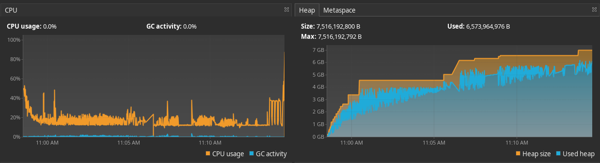
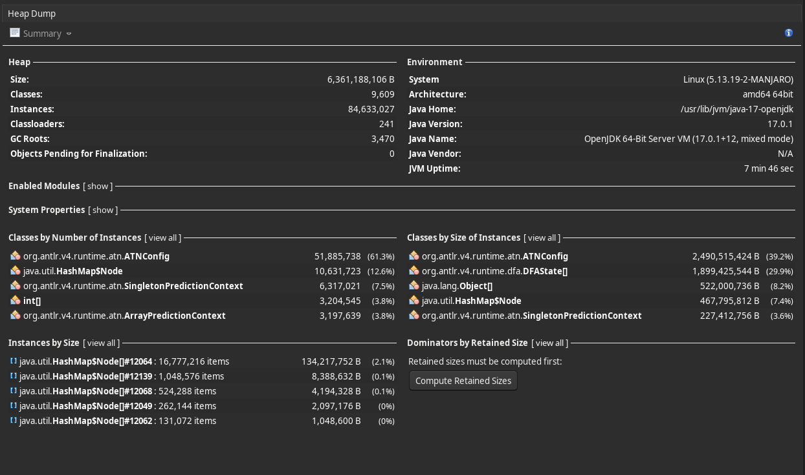

# REPORT

## Abstract

This report is to provide an update with regard to "Issue #10934: OutOfMemory following CheckStyle
9.X upgrade". In this document, I will share the research that I have completed, and provide several
options to resolve the "Out of Memory Error" (OOM) issue.

## Analysis

My first step was to analyze the current memory usage of Checkstyle 9.2 on the openjdk 16
repository. This was the first repository that we noticed the OOM errors with, and had the worst
memory performance compared to the issue reports that we have received. Let's take a look at the
performance of the master branch while parsing openjdk 16 (using
the `no-exception-test.sh openjdk16-with-checks-nonjavadoc-error `
script):





A few facts should be noted:

1. Heap usage grew to the specified maximum (7.5 gb) during Checkstyle execution
2. The offending data structures are:
    1. [ATNConfig](https://www.antlr.org/api/Java/org/antlr/v4/runtime/atn/ATNConfig.html)
    2. [DFAState[]](https://www.antlr.org/api/Java/org/antlr/v4/runtime/dfa/DFAState.html)

In summary, the two objects listed above aid ANTLR create predictions while parsing, to help speed
up execution. The problem is that ANTLR only has a cache eviction strategy for
the `PredictionContext` objects, but not `ATNConfig`
and `DFAState` objects. The
`DFAState[]` are created as we parse files and find new "paths" through the grammar (edges in a
deterministic finite automata) that have not yet been traversed. The idea is that perhaps this same
path exists elsewhere, and we can predict it and not have to build a new graph. The `ATNConfig`
tracks rule invocations that we have passed through, and the state that we are currently in while
parsing.

These objects are never cleared during the entirety of Checkstyle execution.

The problem is exacerbated by the following factors when considering the openjdk 16 repository:

1. Syntax in the repository includes code from the last couple of decades, including methods that
   are deprecated and other code that is no longer used. This contributes to memory usage from
   creating more paths than a project that has been written to target only one or two releases of
   Java.
2. Hundreds of contributors (coding styles) add to the different paths to be found.
3. Java usage has changed, aside from syntax changes over the years. The varying ways to write the
   same code causes more paths.
4. Challenging test cases that contain code not found elsewhere in the repository, that is
   specifically written to be problematic to parse, making large, complicated paths.
5. The number of files (60,000+) compounds the above issues, by allowing ANTLR to create even more
   paths.

Through my research and trials, I have found that clearing these objects before parsing each file
has greatly decreased the amount of memory used:


Note that both the parser and lexer store a large number of these objects, so it is helpful to clear
these objects from both. Only clearing the lexer **or** parser did not have a significant enough
impact on memory usage.

You can see the implementation that provided these
results [here](https://github.com/checkstyle/checkstyle/pull/10999).

## Options for Resolution

From my research, I present three options that we have to resolve this issue, and will explain the
advantages and disadvantages of each.

### Clearing `ATNConfig` and `DFAState[]`

Pros:

- Most effective strategy for lowering memory usage
- Most simple strategy

Cons:

- ANTLR [recommends](https://github.com/antlr/antlr4/issues/1944#issuecomment-314452899)
  that these objects are not cleared for performance reasons, and has worked to remove some ways to
  do so.
- Increases run time by an average of 1.4 times for many projects and CI tasks; however gigantic
  projects like openjdk 16 actually take less time (about 3-4 times faster) in CI. You can compare
  the runtime of CI tasks at https://github.com/checkstyle/checkstyle/pull/10999 and other pull
  requests to see the differences. On my local, `mvn clean verify` run time has increased by one
  minute.

### Eviction Policy

Essentially, we would create a cache for `ATNConfig` and `DFAState[]` in classes derived
from `ATNSimulator`. Currently, ANTLR just accumulates an endless number of these objects.

Pros:

- Decreased memory usage (not as low as "Clearing `ATNConfig` and `DFAState[]`")
- Increased speed compared to "Clearing `ATNConfig` and `DFAState[]`"

Cons:

- Requires extending more ANTLR classes
- Increased future maintenance time when upstream changes are made to extended classes
- Substantially more effort to implement

*Note: an LFU policy would likely be the best way to implement this*

### Grammar Refactoring

Example:

Part of current `expr` rule:

```antlrv4
...
    | expr bop=DOT id                                                      #refOp
    | expr bop=DOT id LPAREN expressionList? RPAREN                        #methodCall
    | expr bop=DOT LITERAL_THIS                                            #thisExp
    | expr bop=DOT LITERAL_NEW nonWildcardTypeArguments?
      innerCreator                                                         #initExp
    | expr bop=DOT nonWildcardTypeArguments?
      LITERAL_SUPER superSuffix?                                           #superExp
    | expr bop=DOT
      nonWildcardTypeArguments
      id LPAREN expressionList? RPAREN                                     #invOp
...

```

Could be refactored into something like:

```antlrv4
...
    | expression bop='.'
      ( IDENTIFIER
      | methodCall
      | THIS
      | NEW nonWildcardTypeArguments? innerCreator
      | SUPER superSuffix
      | explicitGenericInvocation
      )
...
```

The idea here is that we would have less possible paths (or at least shorter paths) to store, since
we only branch AFTER we have matched the `expression` and `.`, tokens. But, now we cannot have
individual `visit...` methods for each type of expression, unless we make another production rule to
be visited, and make named alternatives within that rule. Making a visit method that checks for each
type of expression and handles the necessary logic for each will get complex. Also, the more
rules that we add, the deeper the stack grows as we build our parsetree. In other rules
besides `expr`, this is not such a concern, but the deepest stacks are always seen in expressions (
think concatenations, mathematical expressions, etc.).

In either case, readability is harmed, and therefore increases the complexity of maintainence.
Additionally, I do not think that there are enough areas in our grammar that could be refactored and
make a significant difference in memory consumption.

Pros:

- Recommended by ANTLR in many memory usage issues
- Increases speed of parsing

Cons:

- Makes maintenance of grammar more difficult
- Makes construction of AST more complex in `JavaAstVisitor`
- Would require significant changes to the grammar and `JavaAstVisitor`
- Actual memory usage improvement is likely insufficient

## Conclusion

All solutions require some compromise between runtime, complexity, and memory usage. I think that
the best solution is "
Clearing `ATNConfig` and `DFAState[]`"; it is simple and effective. Since Checkstyle is typically
run in CI, I do not think that it would be a problem to increase execution time a bit. Also, as
noted above, for large projects parsed in CI, runtime has significantly decreased, likely due to
less garbage collection activity and low powered machines. If we choose this solution, I would like
to do some refactoring at https://github.com/checkstyle/checkstyle/pull/10999 to make sure that we
can have test and mutation coverage for the code that optimizes memory usage.

The "Eviction Policy" solution is viable, but I would like to try "Clearing `ATNConfig`
and `DFAState[]`" first, and see how users respond to an increased execution time. We can always
implement some sort of cache later if the need arises. I wrote the grammar and `JavaAstVisitor` in a
fashion that would make future maintainence as simple as possible; I would only proceed with "
Grammar Refactoring" as a last resort.
